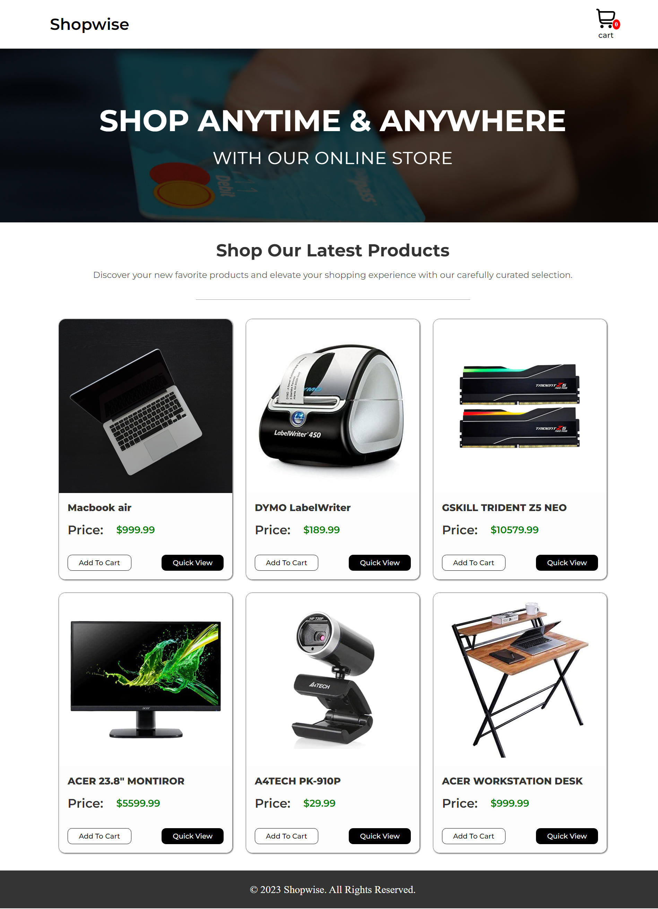
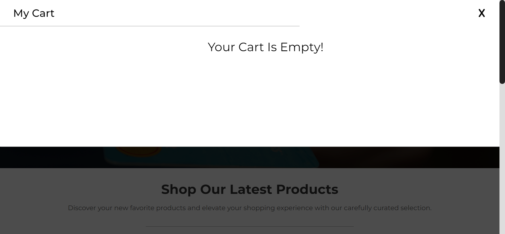

# Shopwise

This project is a responsive and user-friendly e-commerce store designed to provide a seamless online shopping experience for customers. The website showcases a variety of products for sale in a visually appealing single-page layout. Additionally, the website features a convenient cart function that allows customers to add items to their cart and keep track of their purchases during checkout.
 

## Tools

- HTML
- CSS
- JavaScript
   

## Main Features

- Easy-to-use menu bar that lets you see what you've added to your cart.
- Clear layout showing all the products you can buy. You can quickly see details of each product by clicking "Quick View."
- Simple "Add to Cart" button for each product that makes it easy to buy what you want.
- Helpful product info like product name, images, and price.
   

## Screenshots

- **Full page**

- **Cart**

---

## 🚀 About Me
I'm a front End developer, I have the ability to build interactive, responsive and Organized Websites.

## 🛠 Skills
- HTML
- CSS
- JavaScript
- Sass
- PugJs
- GulpJs
- BootStrap
- React.js
- React ecosystems (React Router - React Redux)
- Redux | Redux Toolkit 

## 🔗 Links

